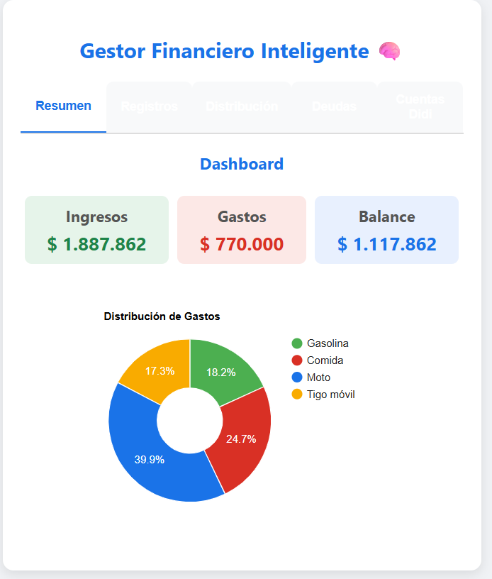
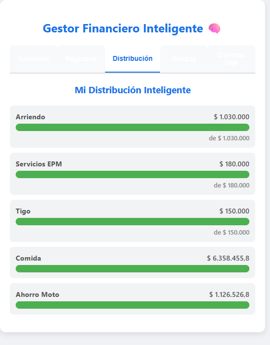

# 💰 Gestor Financiero Inteligente (Google Apps Script)

**Gestor Financiero Inteligente** es una aplicación web progresiva y automatizada para el control total de finanzas personales. A diferencia de las plantillas tradicionales de Excel, este sistema utiliza **automatización en la nube** para distribuir ingresos inteligentemente, proyectar ahorros y controlar deudas en tiempo real.

Desarrollado 100% en el ecosistema de Google (**Sheets + Apps Script**), garantizando acceso desde cualquier dispositivo sin costos de suscripción.

---

## 🚀 Características Clave

### 🧠 Algoritmo de Distribución Inteligente
El corazón del sistema. Al registrar un ingreso, el algoritmo:
*   Analiza tus **metas financieras** (Ahorro, Inversión, Gastos Fijos).
*   Verifica la **prioridad** de cada meta.
*   Calcula automáticamente cuánto destinar a cada rubro basándose en porcentajes predefinidos y necesidades faltantes.
*   **Resultado:** Cada peso que ingresa tiene un propósito inmediato.

### 📉 Control de Deudas "Bola de Nieve"
*   Módulo específico para registrar abonos a deudas.
*   Visualización clara del capital pendiente vs. pagado.
*   Registro automático de fecha de último pago para evitar moras.

### 📊 Dashboard Financiero Completo
*   **Ingresos vs Gastos:** Comparativa mensual automática.
*   **Desglose por Categorías:** Gráficos dinámicos para identificar fugas de dinero.
*   **Control de "Cuentas DiDi" y Bolsillos:** Monitoreo unificado de saldos en Nequi, Efectivo y Tarjetas.

### 🌐 Interfaz Web Móvil (Web App)
*   No necesitas abrir la hoja de cálculo para registrar datos.
*   Usa una interfaz web limpia (HTML5/CSS3) accesible desde tu celular para registrar gastos en el momento que ocurren.

---

## 🛠️ Stack Tecnológico

*   **Backend:** Google Apps Script (JavaScript Serverless).
*   **Base de Datos:** Google Sheets (Estructurada relacionalmente).
*   **Frontend:** HTML5, CSS3, JavaScript (Google Web App).
*   **Visualización:** Google Charts / Chart.js.

---

## 📋 Estructura de Datos

El sistema se alimenta de una Hoja de Cálculo principal con las siguientes pestañas estructuradas:
1.  **Ingresos_Diarios:** Bitácora de entradas de dinero.
2.  **Gastos_Diarios:** Bitácora de salidas categorizadas.
3.  **Distribucion:** Configuración de metas, porcentajes y prioridades para el algoritmo inteligente.
4.  **Deudas:** Control de pasivos y amortizaciones.
5.  **Cuentas_Didi:** Snapshot de saldos en diferentes cuentas financieras.

---

## 💻 Instalación y Uso

Este proyecto es de código abierto para fines educativos. Si deseas implementar tu propia versión:

1.  **Configura tu Base de Datos:**
    *   Descarga el archivo `Base_Datos_Demo.xlsx` de este repositorio.
    *   Súbelo a tu Google Drive y ábrelo como Hoja de Cálculo de Google.
    *   (Opcional) Borra los datos de ejemplo, pero **mantén los encabezados** y nombres de pestañas intactos.

2.  **Instala el Código:**
    *   En tu nueva hoja, ve a `Extensiones` > `Apps Script`.
    *   Copia el contenido de `Código.gs` en el editor.
    *   Copia el contenido de `Index.html` creando un archivo HTML homónimo.

3.  **Despliegue:**
    *   Implementa como aplicación web (`Deploy` > `Web App`).
    *   Autoriza los permisos necesarios para que el script acceda a tu hoja.

---

## 📸 Galería de Capturas

| **Dashboard Principal** | **Distribución Inteligente** |
|:---:|:---:|
|  |  |
| **Resumen de estado financiero** | **Motor de asignación de ingresos** |

| **Registro de Movimientos** | **Control de Deudas** |
|:---:|:---:|
|  |  |
| **Interfaz de captura rápida** | **Seguimiento método bola de nieve** |

---

## 📄 Autor

Desarrollado por **[John Fredy Muñoz](https://www.linkedin.com/in/jfmu%C3%B1oz/)**.
Especialista en Automatización de Procesos y Desarrollo con Google Technologies.
